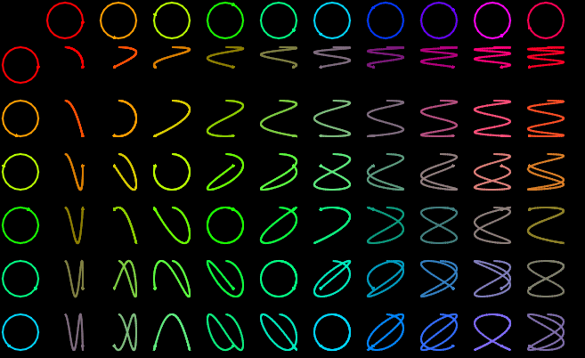

# Lissajous table

I was inspired by this video "[Making a physical Lissajous curve](https://www.youtube.com/watch?v=4CbPksEl51Q)"
and thought "That looks pretty cool and easy to code". So here it is a program
which draws a resizable lissajous table. The wider or higher your window is
the more circles will be drawn.

## Starting

To run this project you need to install [Love2D](https://love2d.org) yourself.
There is a great tutorial on how to do all of this [here](https://love2d.org/wiki/Getting_Started).

